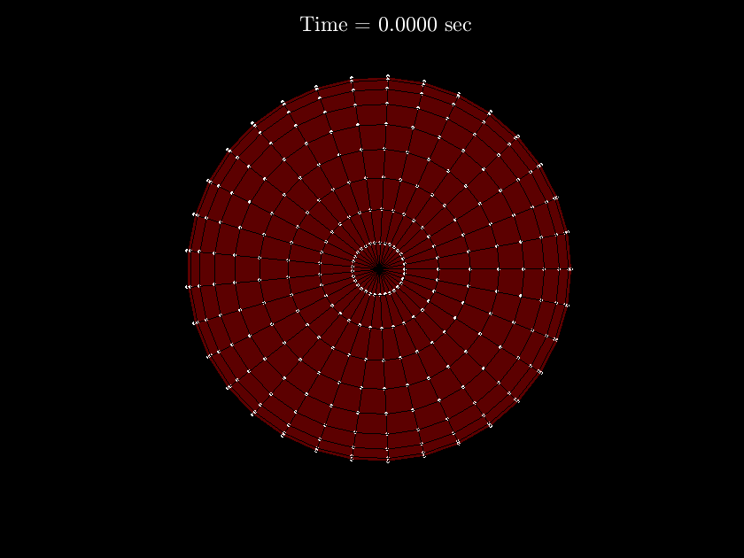

# SpectralBoundaryIntegralMethod.m: Spectral boundary integral method code

- This code was developed for part of [my dissertation](https://www.researchgate.net/publication/355033649_Simulations_of_Red_Blood_Cell_Flow_by_Boundary_Integral_Methods) to simulate red blood cell flow using boundary integral methods.
- This repository contains the code for the concepts and examples presented in Chapter 4 for analyzing the red blood cell motion and deformation in an unbounded domain.

# Numerical examples

## Purely elastic membrane model

### Simple shear flow

#### Membrane shape

| In xy-axis | In 3D |
| :-: | :-: |
|||

#### In-plane isotropic membrane tension

| In xy-axis | In 3D |
| :-: | :-: |
|||

#### Membrane forces and the fluid flow field inside and outside of the red blood cell

|Membrane forces | The fluid flow field inside and outside of the red blood cell|
| :-: | :-: |
||<video src="https://user-images.githubusercontent.com/13091572/209028388-9f9fb88d-4f5b-4100-90b3-717cebe39da9.mp4" width="600" >|

### Parabolic flow

#### Membrane shape

| In xy-axis | In 3D |
| :-: | :-: |
|||

#### In-plane isotropic membrane tension

| In xy-axis | In 3D |
| :-: | :-: |
|||

#### Membrane forces and the fluid flow field inside and outside of the red blood cell

|Membrane forces | The fluid flow field inside and outside of the red blood cell|
| :-: | :-: |
||<video src="https://user-images.githubusercontent.com/13091572/209022041-c561f04c-ca31-4d72-a89f-f6524374c075.mp4" width="600" >|

## Viscoelastic membrane model

### Parabolic flow

#### Membrane shape

| In xy-axis | In 3D |
| :-: | :-: |
|||

#### In-plane isotropic membrane tension

| In xy-axis | In 3D |
| :-: | :-: |
|||

#### Membrane forces and the fluid flow field inside and outside of the red blood cell

|Membrane forces | The fluid flow field inside and outside of the red blood cell|
| :-: | :-: |
||<video src="https://user-images.githubusercontent.com/13091572/209037857-2d97b21f-55fd-42d1-8d96-dc1168a5cae4.mp4" width="600" >|

## Citation

    @phdthesis{gurbuz2021Thesis,
    title={Simulations of Red Blood Cell Flow by Boundary Integral Methods},
    author={G\"urb\"uz, Ali},
    year={2021},
    school={State University of New York at Buffalo}
    }
